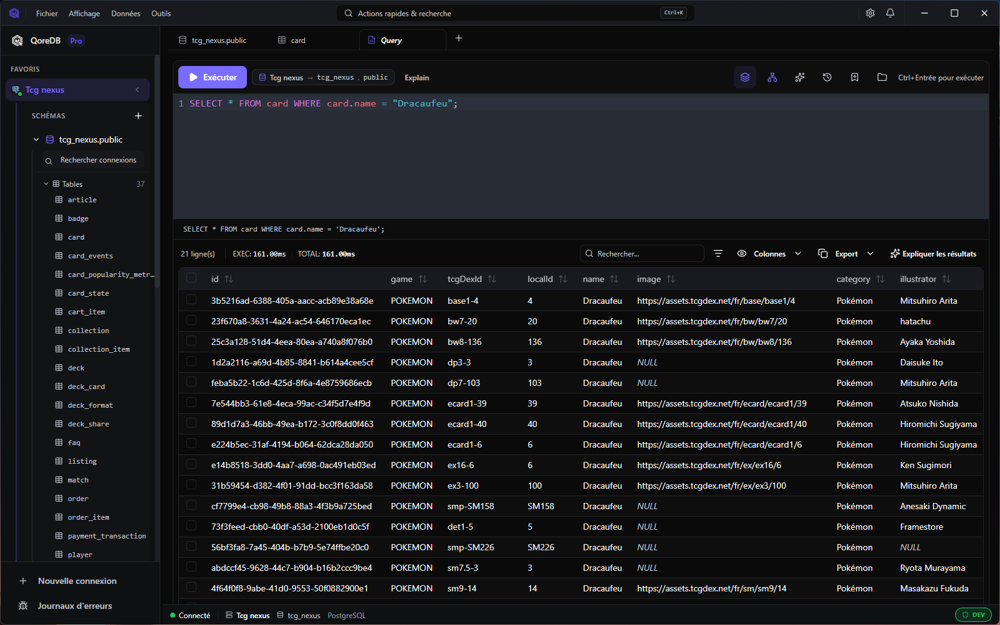
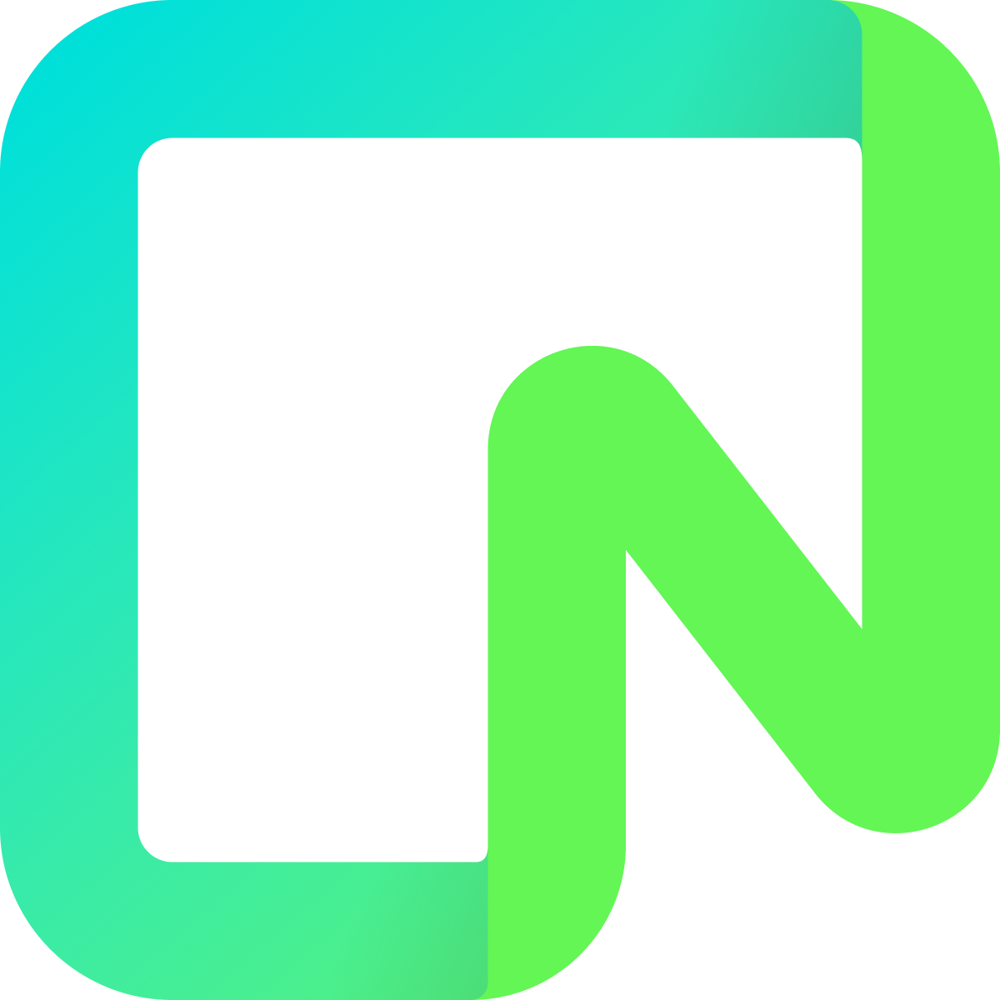
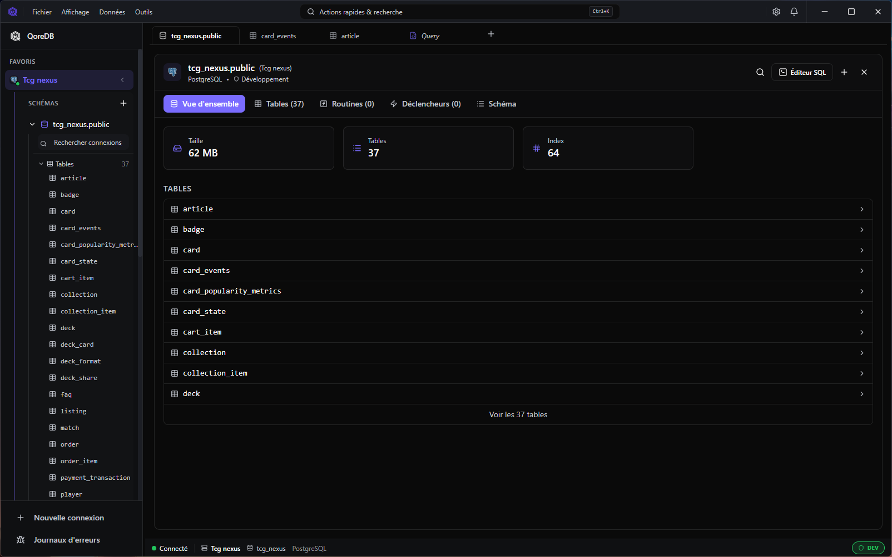
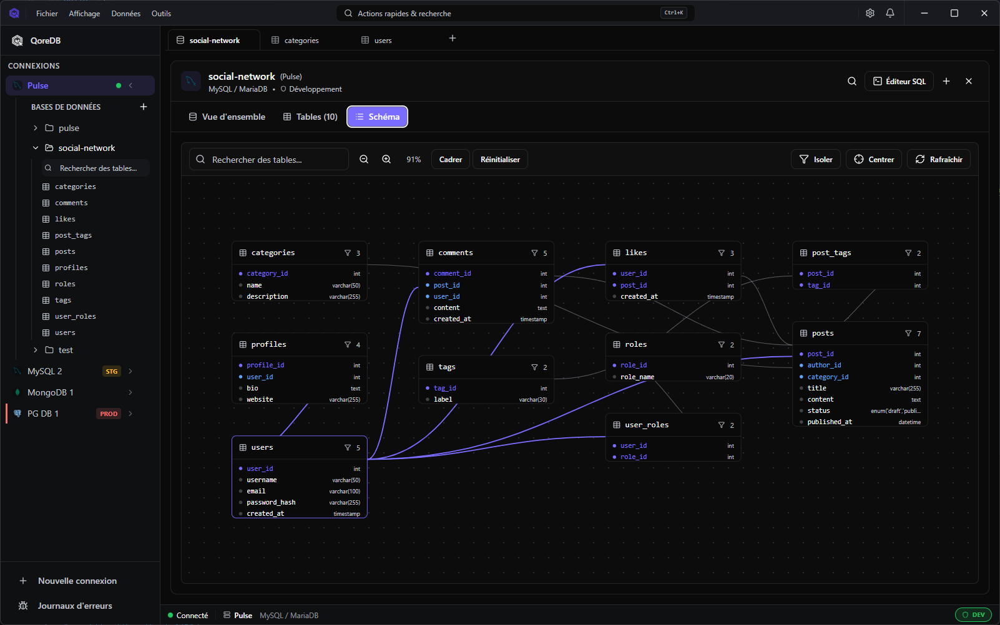
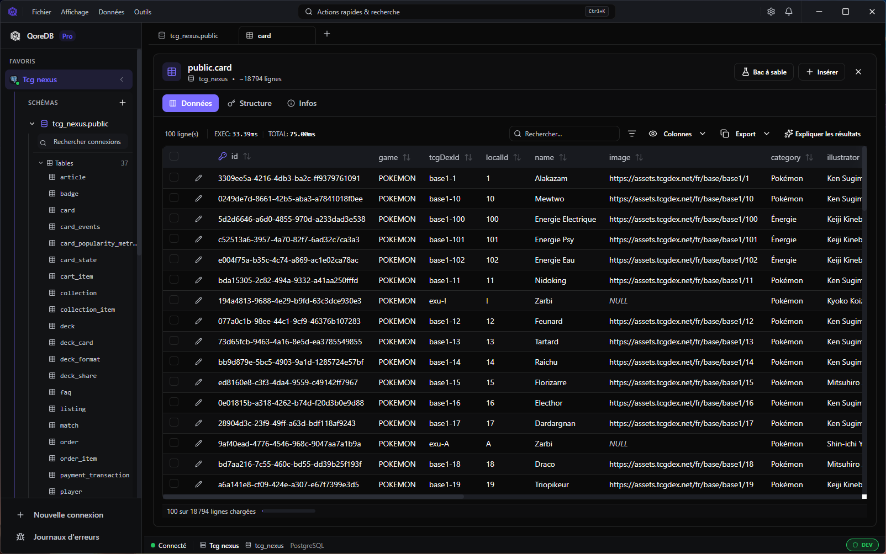

<div align="center">
  

# QoreDB

**One app for all your databases.**

The fast, open-source database client built with Rust. Connect to **12 native drivers** from a single, beautiful interface. Local-first: your data stays yours.

[](LICENSE)
[](https://github.com/raphplt/QoreDB/releases)
[](https://github.com/raphplt/QoreDB/releases)
[](https://github.com/raphplt/QoreDB/stargazers)
[](https://github.com/raphplt/QoreDB/issues)
[](#installation)

[**Website**](https://qoredb.com) · [**Download**](https://qoredb.com/download) · [**Docs**](https://qoredb.com/docs) · [**Roadmap**](https://qoredb.com/roadmap) · [**Discord**](https://discord.gg/Yr6P3wuZDt)

  

</div>

---

## Why QoreDB?

DBeaver, pgAdmin, phpMyAdmin do the job — but they feel slow, dated, and full of dialogs from another era. QoreDB is what we wished existed: a tool you actually enjoy opening every morning.

| | |
|---|---|
| ⚡ **Native performance** | Rust + Tauri. No Electron tax — small binary, instant startup, low memory. ~25% faster on real workloads than the previous baseline (Apple Silicon). |
| 🔒 **Local-first & secure** | Credentials in your OS keychain (Argon2). Dev/Staging/Prod guards, dangerous query detection, read-only mode. Nothing leaves your machine by default. |
| 🧩 **SQL + NoSQL, unified** | One UI for PostgreSQL, MySQL, SQL Server, SQLite, DuckDB, CockroachDB, MongoDB and Redis — plus first-class support for Supabase, Neon and TimescaleDB. |
| 📓 **Notebooks built-in** | Executable SQL/Mongo + Markdown documents with parameters, charts and Git-diffable `.qnb` files. |
| 🛡️ **Safety-first** | Universal Query Interceptor, audit logging, sandbox mode with migration generation. Production damage is harder to do by accident. |
| 🤝 **Open core** | Apache 2.0 core, readable and auditable. Premium add-ons under BUSL-1.1 — never at the expense of the open-source experience. |

---

## Supported databases

<div align="center">
  &nbsp;&nbsp;
  &nbsp;&nbsp;
  &nbsp;&nbsp;
  &nbsp;&nbsp;
  &nbsp;&nbsp;
  &nbsp;&nbsp;
  &nbsp;&nbsp;
  &nbsp;&nbsp;
  &nbsp;&nbsp;
  &nbsp;&nbsp;
  &nbsp;&nbsp;
  
</div>

<div align="center">
  <sub>Driver auto-detection from DSN — paste a connection string and QoreDB picks the right driver.</sub>
</div>

---

## Screenshots

<table>
  <tr>
    <td width="50%"><br/><sub><b>Database browser</b> — multi-connection sidebar, table preview, breadcrumbs.</sub></td>
    <td width="50%"><br/><sub><b>SQL editor</b> — autocomplete, formatting, multi-statement execution, virtualized result grid.</sub></td>
  </tr>
  <tr>
    <td width="50%"><br/><sub><b>ER diagram</b> — interactive schema graph with isolate/focus workflows.</sub></td>
    <td width="50%"><br/><sub><b>Data grid</b> — virtualization, column pinning, advanced filters, inline editing.</sub></td>
  </tr>
</table>

---

## Features

<details open>
<summary><b>Query &amp; schema</b></summary>

- **SQL editor** — Syntax highlighting, formatting, snippets, multi-statement execution
- **MongoDB editor** — Autocomplete (collections, methods, operators), real-time JSON linter, aggregation pipeline validation with stage classification and examples
- **QoreQuery** — Type-safe multi-dialect query builder (JOINs, subqueries, aggregates, CAST, COALESCE, LIKE/ILIKE) targeting PostgreSQL, MySQL, SQLite, DuckDB and SQL Server
- **Query library** — Folders, tags, JSON import/export, reusable queries
- **ER diagram** — Interactive schema graph with isolate/focus workflows _[Pro]_
- **Visual DDL editor** — Full CREATE and ALTER TABLE from the UI: columns, foreign keys, indexes, check constraints with live driver-specific SQL preview
- **Explain Plan visualization** — Interactive execution plan tree with cost highlighting (PostgreSQL, MySQL, SQL Server)
- **Visual data diff** — Side-by-side comparison of table/query results _[Pro]_
- **Global full-text search** — Search values across all tables and columns
- **Foreign key peek + virtual relations** — Navigation even without native FK constraints
- **Routines, procedures, triggers & events** — List, create and edit stored objects with SQL templates
</details>

<details>
<summary><b>Data operations</b></summary>

- **High-performance data grid** — Virtualization, server-side filtering/sorting, pagination, infinite scroll, column pinning
- **Advanced column filters** — `contains`, `regex`, `greater than`, `between` and more across every driver
- **Inline editing** — Edit rows directly in SQL and NoSQL datasets
- **Bulk edit** — Multi-row column updates from the grid with live SQL preview (≤ 5 rows in Core, more in Pro)
- **Time Travel** — Browse the history of any row with a visual timeline, diff between any two points, preview Rollback SQL before reverting _[Pro]_
- **Blob/binary viewer** — Hex / base64 / image preview (PNG, JPEG, GIF, SVG, BMP, ICO) with copy-as-data-URI
- **CSV import** — Automatic separator/encoding detection, column mapping, preview before import
- **Transaction management** — Toggle autocommit, explicit Commit/Rollback, active transaction indicator
- **Export pipeline** — CSV, JSON, SQL, HTML, self-contained HTML (+ XLSX/Parquet in Pro)
- **Cross-database federation** — Query and join across active connections via DuckDB
- **Sandbox mode** — Isolated local changes with migration generation
</details>

<details>
<summary><b>Notebooks</b></summary>

- Executable documents mixing SQL/Mongo and Markdown cells, connected to a live database
- Parameterized variables (`$customer_id`, `{{date_from}}`) with typed inputs
- Run All / Run From Here with stop-on-error
- Inter-cell references and Chart cells (bar, line, pie, scatter) _[Pro]_
- Import from `.sql` / `.md`, export to Markdown or standalone HTML
- `.qnb` file format, Git-diffable
</details>

<details>
<summary><b>MongoDB &amp; Redis</b></summary>

- **MongoDB** — Bulk write/find, aggregation pipeline validation, regex and text search, native index management UI
- **Redis** — Create, edit and delete keys and values across all Redis types from the UI, with Lua script evaluation
</details>

<details>
<summary><b>Security &amp; reliability</b></summary>

- **Secure vault** — Native OS keychain storage (Argon2) + optional app lock
- **SSH tunneling** — Native OpenSSH client with proxy jump support
- **SQL Server Windows authentication** — NTLM (username/password) and SSPI/Kerberos (integrated, no credentials)
- **Environment safety** — Dev/Staging/Prod guards, dangerous query detection, read-only mode
- **Universal Query Interceptor** — Central hooks for safety, audit and profiling
- **Audit logging** — Sensitive content redaction in logs
- **Connection resilience** — Automatic reconnection, health monitoring, smart keep-alive
- **Background job manager** — Async execution for long-running tasks with error recovery
</details>

<details>
<summary><b>User experience</b></summary>

- **Workspaces** — Group connections, queries, notebooks and history per project
- **Multi-tab workspace** — Drag-and-drop reorder, pinned tabs, persistent context across connection switches
- **Tab groups** — Tabs grouped by connection, collapsible, per-tab context menu
- **Session restore** — Tabs and their state persist on app restart
- **Global search** — `Cmd/Ctrl + K` across connections, history, commands, library
- **Breadcrumb navigation** — `Connection > Database > Schema > Table` clickable path
- **Dark / light theme**
- **9 languages** — English, French, Spanish, German, Portuguese (BR), Russian, Japanese, Korean, Chinese (Simplified)
</details>

<details>
<summary><b>AI assistant <i>[Pro]</i></b></summary>

- Contextual query generation and error correction
- Schema-aware suggestions
- Bring your own key (OpenAI, Anthropic, …)
</details>

<details>
<summary><b>Performance</b></summary>

- ~25% faster on real workloads (Apple Silicon) thanks to per-column decoders, MessagePack streaming between Rust and the frontend, batch streaming, expanded LRU caches, `mimalloc` allocator and PGO release builds
- Lazy loading — heavy frontend modules load on demand for faster startup
</details>

---

## How QoreDB compares

| | **QoreDB** | DBeaver | TablePlus | pgAdmin |
|---|---|---|---|---|
| Open source core | ✅ Apache 2.0 | ⚪ Community | ❌ No | ✅ Yes |
| Multi-database (SQL + NoSQL) | ✅ 12 drivers | ✅ Yes | ⚪ Limited | ❌ PG only |
| Native performance | ✅ Rust/Tauri | ❌ Java/Swing | ✅ Native | ❌ Web-based |
| Local-first / no cloud | ✅ Yes | ✅ Yes | ✅ Yes | ✅ Yes |
| Encrypted credential vault | ✅ Argon2 | ⚪ Basic | ✅ Keychain | ❌ No |
| Production safety guards | ✅ Yes | ❌ No | ⚪ Partial | ❌ No |
| Sandbox mode + migrations | ✅ Pro | ❌ No | ❌ No | ❌ No |
| Full-text search (all tables) | ✅ Yes | ❌ No | ❌ No | ❌ No |
| Interactive ER diagram | ✅ Yes | ✅ Yes | ❌ No | ⚪ Partial |
| Cross-database federation | ✅ Pro | ❌ No | ❌ No | ❌ No |
| AI query assistant | ✅ BYOK | ❌ No | ❌ No | ❌ No |
| Modern, fast UI | ✅ Yes | ❌ Dated | ✅ Yes | ❌ No |
| Maturity / ecosystem | ⚪ New | ✅ 15+ years | ⚪ Established | ✅ 20+ years |
| Price (personal use) | **Free / Pro** | Free / $199 | $89 | Free |

We're young but moving fast — see the [public roadmap](https://qoredb.com/roadmap).

---

## Installation

### Download

Grab the latest release for your platform from the [Releases page](https://github.com/raphplt/QoreDB/releases) or [qoredb.com/download](https://qoredb.com/download).

| Platform | Format |
|---|---|
| **macOS** | `.dmg` (Apple Silicon &amp; Intel) |
| **Windows** | `.msi` / `.exe` |
| **Linux** | `.deb` / `.AppImage` |

### Arch Linux (AUR)

```bash
yay -S qoredb-bin
```

### Build from source

**Prerequisites:** Node.js 18+, pnpm, Rust 1.70+, [Tauri system dependencies](https://tauri.app/start/prerequisites/).

```bash
git clone https://github.com/raphplt/QoreDB.git
cd QoreDB
pnpm install
pnpm tauri dev      # development
pnpm tauri build    # production
```

<details>
<summary>Ubuntu / Debian system packages</summary>

```bash
sudo apt-get update
sudo apt-get install -y \
  pkg-config \
  libglib2.0-dev \
  libgtk-3-dev \
  libwebkit2gtk-4.1-dev \
  libayatana-appindicator3-dev \
  librsvg2-dev
```
</details>

---

## Quick start

1. **Launch QoreDB**
2. **Add a connection** — click `+` in the sidebar, or paste a DSN
3. **Connect** — pick the connection in the sidebar
4. **Explore** — browse databases, tables, run queries or open a notebook

### Keyboard shortcuts

| Shortcut | Action |
|---|---|
| `Cmd/Ctrl + K` | Global search |
| `Cmd/Ctrl + N` | New query tab |
| `Cmd/Ctrl + W` | Close current tab |
| `Cmd/Ctrl + Enter` | Execute query |
| `Cmd/Ctrl + S` | Save |
| `Cmd/Ctrl + ,` | Settings |

---

## Development

**Frontend:** React 19 · TypeScript 5.9 · Vite 8 · Tailwind CSS 4 · Radix UI · CodeMirror 6 · TanStack Table · i18next
**Backend:** Rust 2021 · Tauri 2.10 · Tokio · SQLx (PostgreSQL, MySQL, SQLite) · Tiberius + bb8 (SQL Server) · MongoDB &amp; Redis native drivers · DuckDB (embedded analytics + federation)

```bash
pnpm tauri dev              # run app in dev mode (hot reload)
pnpm tauri build            # build production app
pnpm lint:fix               # lint + auto-fix
pnpm format:write           # format code
pnpm test                   # run Rust tests
docker-compose up -d        # start dev databases
```

For project structure, architecture notes and contribution workflow, see [CONTRIBUTING.md](CONTRIBUTING.md) and [`doc/`](doc/).

---

## Roadmap &amp; community

- 🗺️ [Public roadmap](https://qoredb.com/roadmap) — what's shipped, what's next
- 📝 [Changelog](https://github.com/raphplt/QoreDB/releases) — release notes on GitHub
- 💬 [Discord](https://discord.gg/Yr6P3wuZDt) — get help, share feedback
- 🐛 [Issues](https://github.com/raphplt/QoreDB/issues) — report bugs or request features
- 💼 [LinkedIn](https://www.linkedin.com/company/qoredb/) — follow project updates

---

## Contributing

Contributions are welcome! Please read [CONTRIBUTING.md](CONTRIBUTING.md) before opening a PR. In short:

1. Fork the repo and create a feature branch
2. Run `pnpm lint:fix` and `pnpm test` before pushing
3. Add the SPDX license header to new files (`Apache-2.0` for core, `BUSL-1.1` for premium)
4. Open a PR — we'll review, suggest changes, and ship it

Security issues should be reported privately — see [SECURITY.md](SECURITY.md).

---

## License

QoreDB is **open core**:

- Core files — [Apache 2.0](LICENSE)
- Premium files (ER diagram, data diff, profiling, time travel, …) — [Business Source License 1.1](LICENSE-BSL)

The boundary is documented in [`CLAUDE.md`](CLAUDE.md) and via SPDX headers in every source file.

---

## Acknowledgments

Built on the shoulders of giants:
[Tauri](https://tauri.app/) ·
[CodeMirror](https://codemirror.net/) ·
[Radix UI](https://www.radix-ui.com/) ·
[Tailwind CSS](https://tailwindcss.com/) ·
[SQLx](https://github.com/launchbadge/sqlx) ·
[DuckDB](https://duckdb.org/) ·
[TanStack Table](https://tanstack.com/table) ·
[i18next](https://www.i18next.com/)

---

<div align="center">
  <sub>Made with ❤️ in France by <a href="https://github.com/raphplt">@raphplt</a> — <a href="mailto:qoredb@gmail.com">qoredb@gmail.com</a> · <a href="https://www.linkedin.com/in/raphaël-plassart">LinkedIn</a></sub>
  <br/>
  <sub>If QoreDB makes your day a little better, a ⭐ on GitHub goes a long way.</sub>
</div>
